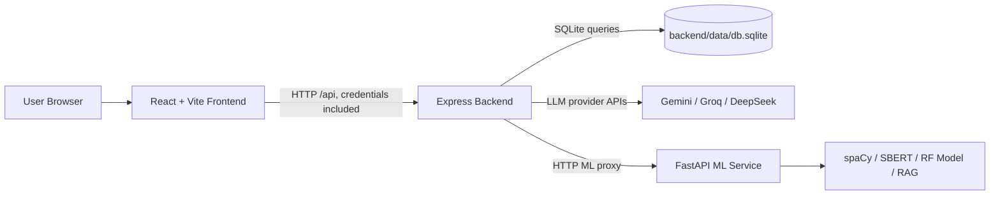

# AI Software Engineer - Detailed Project Demo Documentation

This document is a complete walkthrough of the AI Software Engineer project as implemented in this workspace. It follows the real user journey from authentication to SDLC orchestration, then explains what happens in the frontend, backend, database, LLM layer, and ML service for each page.

The application is a full-stack AI-assisted SDLC platform. A user creates a project workspace, produces requirements and SRS artifacts, converts those artifacts into system design outputs, generates and reviews implementation code, creates a runnable project folder, and validates code through testing, defect prediction, traceability, and project memory.

---

## 1. High-Level System Architecture

### 1.1 Runtime Services

The project is split into three main runtime layers:

1. **Frontend**
   - Location: `frontend/`
   - Framework: React with Vite
   - Routing: `react-router-dom`
   - Main entry: `frontend/src/App.jsx`
   - API client: `frontend/src/lib/api.js`
   - Purpose: Presents the workspace UI, collects user inputs, renders AI/ML outputs, manages project documents, and navigates through SDLC phases.

2. **Backend**
   - Location: `backend/`
   - Framework: Node.js with Express
   - Main server: `backend/server.js`
   - Database: SQLite through `better-sqlite3`
   - Authentication: `express-session` with PBKDF2 password hashing
   - Purpose: Owns sessions, project persistence, prompt orchestration, provider routing, document extraction, exports, SSE streaming, and ML-service proxy endpoints.

3. **ML Service**
   - Location: `ml-service/`
   - Framework: FastAPI
   - Main service: `ml-service/main.py`
   - Purpose: Performs local NLP/ML tasks such as requirement scoring, conflict detection, defect prediction, traceability analysis, and retrieval for project memory.

### 1.2 Network Topology



Default service URLs:

- Frontend: `http://localhost:5173`
- Backend: `http://localhost:4000`
- ML service: `http://127.0.0.1:8000`

The frontend usually calls the backend through `/api`. When configured, `VITE_API_BASE` can override this. The backend calls the ML service through `ML_SERVICE_URL`, defaulting to `http://127.0.0.1:8000`.

### 1.3 Main Frontend Routes

Defined in `frontend/src/App.jsx`:

| URL | Component | Purpose |
|---|---|---|
| `/auth` | `AuthPage` | Login and registration page |
| `/` | `ProjectsDashboard` inside `ProtectedRoute` | Project list, creation, deletion |
| `/projects/:projectId` | `ProjectLayout` + `UniversalHomePage` | Orchestration command center |
| `/projects/:projectId/requirements` | `HomePage` | Requirements analysis, SDLC recommendation, project plan |
| `/projects/:projectId/srs-editor` | `SRSEditor` | Guided SRS generation, final SRS, quality and conflict analysis |
| `/projects/:projectId/design` | `DesignPage` | Design Studio landing page |
| `/projects/:projectId/design/system` | `SystemDesignWizard` | Architecture and tech stack generation |
| `/projects/:projectId/design/schema` | `DatabaseSchemaGenerator` | Database schema generation |
| `/projects/:projectId/design/diagram` | `DiagramGenerator` | Mermaid diagram generation |
| `/projects/:projectId/implementation` | `ImplementationLab` | Code generation, translation, review |
| `/projects/:projectId/generate` | `ProjectGenerator` | Full runnable project generation |
| `/projects/:projectId/quality` | `ValidationLab` | Test generation, quality metrics, code intelligence |

### 1.4 Main Backend Route Groups

Defined primarily in `backend/server.js` and two routers:

- Auth: `/api/auth/register`, `/api/auth/login`, `/api/auth/logout`, `/api/auth/me`
- Projects: `/api/projects`, `/api/project`, `/api/project/:id`
- Project documents: `/api/projects/:projectId/documents`
- Project insights: `/api/projects/:id/health`, `/api/projects/:id/traceability`, `/api/projects/:id/requirements/sync`
- Requirements and planning: `/api/sdlc/recommend`, `/api/plan/generate`
- SRS: `/api/srs/generate-questions`, `/api/srs/generate-content`, `/api/srs/save-section`, `/api/srs/generate-final/:project_id`, `/api/srs/status/:project_id`
- Design: `/api/design/system`, `/api/design/schema`, `/api/design/diagram`, `/api/design/export`
- Code: `/api/code/generate`, `/api/code/translate`, `/api/code/review`, `/api/code/test`, `/api/code/generate-project`
- Documents: `/api/documents/extract-text`
- ML proxy: `/api/ml/requirements/analyze`, `/api/ml/conflict/detect`, `/api/ml/defect/predict`, `/api/ml/traceability/analyze`, `/api/ml/defect/refactor`
- AI support tools: `/api/ai/reviews/multi-agent`, `/api/ai/rag/answer`, `/api/ai/requirements/decompose`, `/api/ai/requirements/adversarial`

### 1.5 Database Schema

Defined in `backend/db/schema.js`.

| Table | Role |
|---|---|
| `users` | Stores registered accounts with unique `user_id`, email, PBKDF2 hash, phone, age, timestamps |
| `projects` | Stores user-owned project workspaces, project text, SDLC analysis, plan, final SRS content |
| `srs_sections` | Stores generated SRS content per section and subsection |
| `srs_versions` | Stores SRS edit history, editor type, prompt, suggestion, and selected text ranges |
| `project_documents` | Stores generated/uploaded project artifacts shown in the right sidebar |
| `artifact_counters` | Supports sequential artifact IDs |
| `requirements` | Stores extracted requirement sentences with generated requirement IDs and quality scores |
| `design_components` | Stores design artifact/component metadata for traceability support |
| `traceability_links` | Stores requirement-to-design/code/test links |
| `ml_results` | Stores ML result payloads and scores for project health/history |
| `logs` | Stores LLM prompts, raw responses, parsed responses, endpoint, and project ID |

Most child tables have `ON DELETE CASCADE`, so deleting a project removes its sections, versions, documents, requirements, trace links, and ML result history.

---

## 2. Cross-Cutting Architecture Concepts

### 2.1 Protected Routing and Sessions

All important application pages are wrapped in `ProtectedRoute`. On page load, `AuthContext` calls:

```text
GET /api/auth/me
```

If the backend session cookie is valid, the frontend stores the returned user and allows access. If not, the user is redirected to `/auth`.

Backend session handling:

- `express-session` stores session data.
- `req.session.userId` is set after successful login/register.
- Cookies are `httpOnly`.
- In production, `SESSION_SECRET` is required.
- In development, a stable fallback secret is used if no secret exists.

### 2.2 Project Context and Sidebar Documents

The project document system is the central memory layer of the app.

Frontend owner:

- `ProjectLayout` loads the workspace.
- `ProjectProvider` in `ProjectContext.jsx` loads documents and health.
- `ProjectSidebar` displays saved/generated documents.
- Phase pages use `useProjectContext()` to read documents, add documents, toggle context, and refresh health.

Backend owner:

- `backend/routes/projectDocuments.js`
- Endpoints:
  - `GET /api/projects/:projectId/documents`
  - `POST /api/projects/:projectId/documents`
  - `PATCH /api/projects/:projectId/documents/:documentId`
  - `DELETE /api/projects/:projectId/documents/:documentId`

Each document has:

- `id`
- `projectId`
- `name`
- `type`
- `mime`
- `size`
- `source`
- `content`
- `useAsContext`
- timestamps

Important behavior:

- When a saved document has a type containing `SRS`, the backend calls `syncRequirementsFromText(...)`.
- That extracts requirement-like sentences and stores them in the `requirements` table.
- Documents marked `useAsContext=true` are automatically used by later AI tools as grounding context.
- If backend document loading fails, the frontend can fall back to local stored project documents and later sync them back.

### 2.3 Project Health

The right-side SDLC status is powered by:

```text
GET /api/projects/:id/health
```

Backend output includes:

- Requirement artifact count
- Average requirement quality score
- Total document count
- Traceability link count
- Latest ML results
- Phase summaries for requirements, design, implementation, and quality

This health endpoint is used by `PhaseSidebar` to show progress indicators and artifact counts.

### 2.4 LLM Orchestration

Backend LLM logic lives in:

- `backend/services/llm.js`
- `backend/services/prompts.js`
- `backend/services/llmUtils.js`
- `backend/prompts/*.txt`

The backend routes map work to task types:

| Task Type | Used For |
|---|---|
| `fast` | SDLC recommendations, planning, SRS questions/content, requirement decomposition, adversarial testing |
| `reasoning` | System design and database schema generation |
| `creative` | Diagram generation |
| `code` | Code generation, translation, tests, refactoring |
| `review` | Code review and multi-agent review |

The backend validates many LLM responses as JSON. For SDLC and plan generation, AJV validates against schemas in `backend/schemas/`.

Every major LLM call records a row in `logs` with the endpoint, prompt, raw response, parsed response, and project ID.

### 2.5 ML Service Capabilities

FastAPI endpoints in `ml-service/main.py`:

| ML Endpoint | Backend Proxy | Purpose |
|---|---|---|
| `/nlp/requirements/analyze` | `/api/ml/requirements/analyze` | Score requirement clarity, ambiguity, testability, completeness |
| `/nlp/conflict/detect` | `/api/ml/conflict/detect` | Detect contradictions and conflicting requirement pairs |
| `/code/defect/predict` | `/api/ml/defect/predict` | Predict defect risk per function |
| `/code/traceability/analyze` | `/api/ml/traceability/analyze` | Match requirements to code functions |
| `/rag/query` | `/api/ai/rag/answer` | Retrieve relevant project document chunks for question answering |
| `/rag/index` | Direct ML endpoint | Index project docs if needed |

The ML service loads spaCy and SBERT at startup. If heavy models are unavailable, parts of the service include fallback behavior, such as hash-style embeddings or heuristic scoring.

---

## 3. Complete User Flow

## Page 1: Authentication

### 3.1 UI Flow

Route:

```text
/auth
```

Component:

```text
frontend/src/components/AuthPage.jsx
```

The authentication page supports:

- Login mode
- Register mode
- User ID and password login
- Registration with name, email, user ID, password, optional phone number, and age
- Inline error display for failed auth
- Loading states while the request is in progress

After successful login or registration, the app navigates to the project dashboard at `/`.

### 3.2 Frontend Logic

`AuthContext.jsx` exposes:

- `user`
- `loading`
- `login(credentials)`
- `register(payload)`
- `logout()`
- `isAuthenticated`

On initial load, it calls:

```text
GET /api/auth/me
```

Login sends:

```json
{
  "user_id": "student123",
  "password": "secret123"
}
```

Register sends:

```json
{
  "name": "Student Name",
  "email": "student@example.com",
  "user_id": "student123",
  "password": "secret123",
  "phone_number": "optional",
  "age": 21
}
```

### 3.3 Backend Logic

Registration endpoint:

```text
POST /api/auth/register
```

Backend steps:

1. Validate that name, email, user ID, and password are present.
2. Enforce minimum password length of 6 characters.
3. Check whether user ID or email already exists.
4. Generate a UUID for the internal user ID.
5. Hash the password with PBKDF2 and a random salt.
6. Insert the new row into `users`.
7. Set `req.session.userId` and `req.session.userIdDisplay`.
8. Return a sanitized user object.

Login endpoint:

```text
POST /api/auth/login
```

Backend steps:

1. Validate user ID and password.
2. Fetch the user from `users`.
3. Verify the password using the stored salt and hash.
4. Set the session.
5. Return the user object.

Session check:

```text
GET /api/auth/me
```

Backend steps:

1. `requireAuth` checks the session.
2. Backend fetches the user from `users`.
3. Frontend stores the returned user.

### 3.4 Database Tables

- `users`

### 3.5 Technologies Used

- React context for auth state
- Axios API client with cookies
- Express sessions
- PBKDF2 password hashing through Node `crypto`
- SQLite user persistence

---

## Page 2: Projects Dashboard

### 4.1 UI Flow

Route:

```text
/
```

Component:

```text
frontend/src/components/ProjectsDashboard.jsx
```

The dashboard is the first authenticated page. It shows:

- Existing projects for the logged-in user
- A create-project form
- Project cards with title and created date
- Open project action
- Delete project confirmation flow
- Empty state when no projects exist

### 4.2 Frontend Logic

On mount:

```text
GET /api/projects
```

Create project:

```text
POST /api/project
```

Typical payload:

```json
{
  "title": "AI Attendance Management System",
  "project_text": ""
}
```

Delete project:

```text
DELETE /api/project/:id
```

Open project:

```text
/projects/:projectId
```

### 4.3 Backend Logic

`GET /api/projects`:

1. Requires a valid session.
2. Selects projects where `projects.user_id = req.session.userId`.
3. Orders them for display.
4. Returns project metadata.

`POST /api/project`:

1. Requires auth.
2. Creates a project ID using a timestamp-style ID.
3. Inserts project title, project text, and owning user ID.
4. Returns the new project.

`DELETE /api/project/:id`:

1. Requires auth.
2. Confirms the project belongs to the session user.
3. Deletes the project.
4. Child artifacts are deleted through cascade foreign keys.

### 4.4 Database Tables

- `projects`
- Cascading related tables:
  - `srs_sections`
  - `srs_versions`
  - `project_documents`
  - `requirements`
  - `design_components`
  - `traceability_links`
  - `ml_results`
  - `logs`

---

## Page 3: Project Workspace Shell

### 5.1 UI Flow

Route:

```text
/projects/:projectId
```

Layout component:

```text
frontend/src/components/ProjectLayout.jsx
```

Nested default page:

```text
frontend/src/components/UniversalHomePage.jsx
```

The workspace shell wraps every SDLC phase. It contains:

- Main content area for the active phase
- `PhaseSidebar` showing SDLC progress
- `ProjectSidebar` showing saved/generated documents
- Workspace loading state
- Project-not-found state

### 5.2 Frontend Logic

`ProjectLayout` loads project metadata:

```text
GET /api/project/:projectId
```

Then it creates `ProjectProvider`, which loads:

```text
GET /api/projects/:projectId/documents
GET /api/projects/:projectId/health
```

The provider exposes document operations:

- `addDocument(doc)`
- `removeDocument(docId)`
- `toggleUseAsContext(docId)`
- `refreshDocuments()`
- `refreshHealth()`

### 5.3 Backend Logic

Project metadata:

```text
GET /api/project/:id
```

Returns:

- Project row
- Version count for SRS history

Documents:

```text
GET /api/projects/:projectId/documents
```

Returns documents from `project_documents`, transformed into frontend camelCase fields.

Health:

```text
GET /api/projects/:id/health
```

Calculates:

- Total requirements
- Average quality score
- Total documents
- Total traceability links
- Recent ML outputs

### 5.4 Why This Layer Matters

Every later page depends on this layer. Requirements, design outputs, generated code, reviews, diagrams, and quality reports all become sidebar documents. Marking documents as `Use in context` makes them available to later LLM and ML workflows.

---

## Page 4: Universal Home / Orchestration Page

### 6.1 UI Flow

Route:

```text
/projects/:projectId
```

Component:

```text
frontend/src/components/UniversalHomePage.jsx
```

This page is the SDLC command center. It displays phase cards:

1. Requirements & Analysis
2. System Design
3. Coding & Implementation
4. Project Generator
5. Testing & Quality

It also includes:

- Back to projects button
- Current project name
- Multi-agent review panel
- Project memory panel

### 6.2 Phase Navigation

Each card navigates into a nested route:

| Phase Card | Route |
|---|---|
| Requirements & Analysis | `/projects/:projectId/requirements` |
| System Design | `/projects/:projectId/design` |
| Coding & Implementation | `/projects/:projectId/implementation` |
| Project Generator | `/projects/:projectId/generate` |
| Testing & Quality | `/projects/:projectId/quality` |

### 6.3 Multi-Agent Review

Component:

```text
frontend/src/components/MultiAgentReviewPanel.jsx
```

Frontend call:

```text
POST /api/ai/reviews/multi-agent
```

Payload:

```json
{
  "project_id": "p171..."
}
```

Backend processing:

1. Loads documents where `use_as_context = 1`.
2. Builds a text context block from project documents.
3. Loads three prompt templates:
   - `multi_agent_architect_review.txt`
   - `multi_agent_security_review.txt`
   - `multi_agent_performance_review.txt`
4. Calls the LLM three times in parallel using task type `review`.
5. Parses each response into structured review output.
6. Returns architect, security, and performance review sections.

Frontend rendering:

- Shows review summaries
- Shows risks
- Shows recommended actions
- Handles unavailable context by telling the user to mark documents as context

### 6.4 Project Memory

Component:

```text
frontend/src/components/ProjectMemoryPanel.jsx
```

Frontend call:

```text
POST /api/ai/rag/answer
```

Payload:

```json
{
  "project_id": "p171...",
  "question": "What authentication model does this project use?"
}
```

Backend processing:

1. Loads context documents for the project.
2. Excludes data URI files from RAG context.
3. Sends documents to ML service `/rag/query`.
4. ML service chunks and embeds the text, then returns top matches.
5. Backend builds a final LLM prompt using `rag_answer_prompt.txt`.
6. Backend returns answer, confidence, sources, and raw matches.

ML processing:

- Uses SBERT embeddings where available.
- Retrieves top-k chunks.
- Returns source document names and matching text snippets.

Frontend rendering:

- User asks a natural-language project question.
- Answer is shown with confidence and sources.
- This turns the sidebar documents into project memory.

---

# Phase 1: Requirements & Analysis

## Page 5: Requirements Workspace / Project Analysis Tool

### 7.1 UI Flow

Route:

```text
/projects/:projectId/requirements
```

Component:

```text
frontend/src/components/HomePage.jsx
```

The page collects initial project context:

- Project title
- Project description
- Team size
- Timeline
- Budget

It provides actions:

- Recommend SDLC
- Generate Project Plan
- Generate Implicit Requirements
- Open SRS Editor

It also includes two helper panels:

- Requirement Decomposer
- Adversarial Tester

### 7.2 Context Usage

The page reads documents from `ProjectContext`. Any document marked `useAsContext` is appended to the project description as context:

```text
---
[SRS] Student Attendance SRS
...
```

This means the requirements page can use previously saved SRS, plan, design, or quality documents to improve later outputs.

### 7.3 SDLC Recommendation Flow

Frontend call:

```text
POST /api/sdlc/recommend
```

Payload:

```json
{
  "project_text": "Project description plus selected context documents",
  "constraints": {
    "team_size": 4,
    "timeline": "3 months",
    "budget": "medium"
  }
}
```

Backend processing:

1. Validates that `project_text` exists.
2. Loads `backend/prompts/sdlc_prompt.txt`.
3. Injects the project text and constraints.
4. Calls the LLM with task type `fast`.
5. Extracts JSON from the response.
6. Validates it against `sdlc_recommendation.schema.json`.
7. Ensures confidence is normalized between 0 and 1.
8. Stores the call in `logs`.
9. Returns the validated recommendation.

Expected output fields:

- `model`
- `why`
- `when_not_to_use`
- `confidence`

Frontend rendering:

- `ResultsPanel` shows the recommended SDLC model.
- Confidence is displayed as a percentage.
- User can download the recommendation as text.
- User can save it as a sidebar document of type `SDLC`.

### 7.4 Project Plan Flow

Frontend call:

```text
POST /api/plan/generate
```

Payload includes:

- `project_text`
- `title`
- `team_size`
- `timeline`
- `budget`

Backend processing:

1. Validates `project_text`.
2. Loads `backend/prompts/plan_prompt.txt`.
3. Calls LLM with task type `fast`.
4. Validates response against `plan_requirements.schema.json`.
5. Logs the interaction.
6. Returns milestones and implicit requirements.

Frontend rendering:

- Milestones are shown with:
  - Title
  - Duration in weeks
  - Deliverables
  - Roles required
- User can download the plan.
- User can save it to the sidebar as type `Plan`.

### 7.5 Implicit Requirements Flow

The same endpoint powers implicit requirement generation:

```text
POST /api/plan/generate
```

The frontend extracts `implicit_requirements` from the returned JSON and renders:

- Requirement title
- Requirement type
- Priority
- Description
- Rationale

Saving creates a document of type `Requirements`.

### 7.6 Save as SRS Draft

`HomePage` can build an SRS draft from:

- Project description
- SDLC recommendation
- Project plan
- Implicit requirements

Saving creates a sidebar document:

```json
{
  "type": "SRS",
  "mime": "text/plain",
  "source": "generated",
  "useAsContext": true
}
```

Because the type contains `SRS`, the backend automatically syncs extracted requirements into the `requirements` table.

### 7.7 Requirement Decomposer

Component:

```text
frontend/src/components/RequirementDecomposerPanel.jsx
```

Endpoint:

```text
POST /api/ai/requirements/decompose
```

Backend processing:

1. Validates `requirement`.
2. Loads `requirement_decompose_prompt.txt`.
3. Calls LLM with task type `fast`.
4. Parses JSON.
5. Returns decomposed requirement details.

Purpose:

- Breaks a large requirement into clearer subrequirements.
- Helps produce more testable and implementation-ready requirements.

### 7.8 Adversarial Tester

Component:

```text
frontend/src/components/AdversarialTesterPanel.jsx
```

Endpoint:

```text
POST /api/ai/requirements/adversarial
```

Backend processing:

1. Validates `requirement`.
2. Loads `adversarial_stress_tester_prompt.txt`.
3. Calls LLM with task type `fast`.
4. Parses personas and issues.
5. If LLM parsing fails, returns a fallback set of adversarial checks.

Purpose:

- Tests requirements against malicious users, edge cases, security auditors, and unusual inputs.
- Improves requirement robustness before SRS generation.

---

## Page 6: SRS Editor / Requirements Specification Wizard

### 8.1 UI Flow

Route:

```text
/projects/:projectId/srs-editor
```

Component:

```text
frontend/src/components/SRSEditor.jsx
```

The SRS page is a multi-step wizard:

1. Project description
2. Generated questions
3. Section-by-section content generation
4. Progress tracking
5. Final SRS generation
6. Export
7. Requirement quality analysis
8. Conflict detection

### 8.2 Project Creation Behavior

If the SRS editor is opened without an active project ID, it can create a project:

```text
POST /api/project
```

The page then continues with the returned project ID.

Inside the normal workspace flow, it uses the route `projectId`.

### 8.3 Generate SRS Questions

Frontend call:

```text
POST /api/srs/generate-questions
```

Payload:

```json
{
  "description": "Project description..."
}
```

Backend processing:

1. Loads `srs_generate_prompt.txt`.
2. Injects the project description.
3. Calls LLM with task type `fast`.
4. Parses generated questions.
5. Returns questions grouped by SRS sections/subsections.

Frontend rendering:

- The user sees generated questions.
- The user answers questions section by section.
- The wizard keeps track of progress.

### 8.4 Generate SRS Section Content

Frontend call:

```text
POST /api/srs/generate-content
```

Payload includes:

- `project_id`
- `section`
- `subsection`
- User Q&A pairs

Backend processing:

1. Loads `srs_content_prompt.txt`.
2. Builds the prompt from section metadata and user answers.
3. Calls the LLM.
4. Returns generated SRS content for that subsection.

Frontend rendering:

- Generated content is displayed for review.
- User can accept, regenerate, or continue.

### 8.5 Save SRS Section

Frontend call:

```text
POST /api/srs/save-section
```

Backend processing:

1. Upserts into `srs_sections`.
2. Uses the unique key `(project_id, section_id, subsection_id)`.
3. Stores content and status.

Database table:

- `srs_sections`

### 8.6 SRS Status

Frontend call:

```text
GET /api/srs/status/:projectId
```

Backend calculates:

- Completed sections
- Total sections
- Completion percentage
- Section status summary

Frontend rendering:

- Progress bars
- Completion stats
- Section status

### 8.7 Final SRS Generation

Frontend call:

```text
POST /api/srs/generate-final/:projectId
```

Backend processing:

1. Loads saved section content from `srs_sections`.
2. Composes a full SRS document.
3. Fills missing sections with placeholders where needed.
4. Updates `projects.srs_content`.
5. Syncs requirement sentences into `requirements`.
6. Returns the final SRS content.

Database tables:

- `srs_sections`
- `projects`
- `requirements`

### 8.8 DOCX Export

Frontend call:

```text
POST /api/project/:id/export
```

Backend processing:

1. Reads the project SRS content.
2. Uses DOCX generation utilities.
3. Returns a downloadable Word document.

Technologies:

- `docx`
- `backend/services/docx-generator.js`

### 8.9 Requirement Quality Analysis

Frontend call:

```text
POST /api/ml/requirements/analyze
```

Payload:

```json
{
  "project_id": "p171...",
  "srs_text": "Full SRS text",
  "requirements": ["The system shall ..."]
}
```

Backend processing:

1. If `requirements` is empty, extracts requirement sentences from `srs_text`.
2. Limits analysis to 50 requirements per request.
3. Calls ML service `/nlp/requirements/analyze`.
4. Receives scores and issue lists.
5. For low-scoring requirements, optionally asks the LLM for short explanations and fix suggestions.
6. Updates matching rows in `requirements.quality_score`.
7. Returns the scored list.

ML service processing:

- Analyzes ambiguity
- Detects weak wording
- Looks for missing measurable conditions
- Produces a numeric score
- Returns issue categories

Frontend rendering:

- Displays scores per requirement.
- Highlights low-quality items.
- Shows generated explanation if available.

### 8.10 Conflict Detection

Frontend call:

```text
POST /api/ml/conflict/detect
```

Payload:

```json
{
  "project_id": "p171...",
  "requirements": ["Requirement A", "Requirement B"]
}
```

Backend processing:

1. Validates requirement array.
2. Calls ML service `/nlp/conflict/detect`.
3. Receives conflict pairs, graph nodes, graph edges, and summary.
4. For high-confidence conflicts, asks LLM for explanations using `conflict_explanation_prompt.txt`.
5. Returns enhanced conflicts and graph.

Frontend rendering:

- Conflict list
- Conflict confidence
- Explanation
- Graph visualization through `ConflictPanel`
- Graph support uses `react-force-graph-2d`

### 8.11 SRS Editing and Versioning

Backend endpoints:

```text
POST /api/srs/edit
POST /api/srs/apply
GET /api/project/:id/versions
GET /api/project/:id/version/:version
```

Purpose:

- Generate edit suggestions for selected SRS text.
- Apply accepted suggestions.
- Save old and new SRS content versions.
- Track editor, prompt, suggestion, and selection range.

Database table:

- `srs_versions`

---

# Phase 2: System Design

## Page 7: Design Studio Landing

### 9.1 UI Flow

Route:

```text
/projects/:projectId/design
```

Component:

```text
frontend/src/components/DesignPage.jsx
```

The Design Studio acts as a hub for three tools:

1. System Design & Tech Stack Wizard
2. Database Schema Generator
3. Diagram Generator

The page itself is mainly navigational. It expects that requirements/SRS documents have already been saved and marked as context.

---

## Page 8: System Design & Tech Stack Wizard

### 10.1 UI Flow

Route:

```text
/projects/:projectId/design/system
```

Component:

```text
frontend/src/components/SystemDesignWizard.jsx
```

The UI collects:

- Cloud or infrastructure preference
- Legacy systems or tech to integrate
- Team skills
- Business priorities
- Greenfield toggle

It displays:

- Context document count
- Document extraction status
- Generated design output
- Tabs for generated design areas
- Download and save actions

### 10.2 Context Document Handling

The wizard requires at least one sidebar document marked `Use in context`.

For each context document:

1. If content is plain text, it is used directly.
2. If content is a data URI, the frontend calls:

```text
POST /api/documents/extract-text
```

Supported extraction:

- PDF through `pdf-parse`
- DOCX through `mammoth`
- Text data URIs
- Generic data URI decoding where possible

The extracted text is combined as:

```text
---
[Document Name]
Document text...
```

### 10.3 Generate System Design

Frontend call:

```text
POST /api/design/system
```

Payload:

```json
{
  "srs_text": "Combined context document text",
  "context": {
    "cloudPreference": "AWS",
    "legacyTech": "Existing .NET APIs",
    "teamSkills": "React, Node.js, Python",
    "priorities": "Low cost and fast delivery",
    "isGreenfield": true
  }
}
```

Backend processing:

1. Validates `srs_text`.
2. Rejects raw data URIs because documents must be extracted first.
3. Loads `system_design_prompt.txt`.
4. Injects SRS text and context JSON.
5. Calls LLM with task type `reasoning`.
6. Parses structured JSON with fallback to raw design text.
7. Logs the interaction.
8. Returns the design result.

### 10.4 Output Structure

The page expects sections such as:

- `high_level_design`
  - Summary
  - Key components
  - Data flow
  - Integration points
- `tech_stack`
  - Frontend
  - Backend
  - Data
  - Infrastructure
  - Observability
  - Reasoning
  - Alternatives
- `implementation_architecture`
  - Architecture style
  - Services/modules
  - API strategy
  - Data strategy
  - Scalability
  - Security
  - Tradeoffs
- `assumptions`
- `next_steps`

The UI also provides diagram-context tabs:

- Diagram - Sequence
- Diagram - ER
- Diagram - Data Flow
- Diagram - Use Case
- Diagram - Architecture

These tabs convert the design result into focused text that can be saved and used by the Diagram Generator.

### 10.5 Persistence

After generation, the frontend auto-saves:

```json
{
  "name": "System Design YYYY-MM-DD",
  "type": "system_design",
  "mime": "application/json",
  "content": "{ structured design JSON }",
  "useAsContext": true
}
```

This is important because the Project Generator later searches for design documents of type `system_design` or `design`.

---

## Page 9: Database Schema Generator

### 11.1 UI Flow

Route:

```text
/projects/:projectId/design/schema
```

Component:

```text
frontend/src/components/DatabaseSchemaGenerator.jsx
```

The page allows the user to provide:

- Entities
- User stories
- Requirements text
- Desired output format
- Context documents

It outputs database design artifacts such as:

- Entities
- Fields
- Relationships
- DDL SQL
- NoSQL collections
- Sample queries
- Assumptions

### 11.2 Frontend Flow

1. Reads context documents from `ProjectContext`.
2. Extracts text from PDF/DOCX/data URI documents when needed.
3. Calls:

```text
POST /api/design/schema
```

Payload includes:

- `requirements_text`
- `output_format`
- `context_text`

### 11.3 Backend Processing

Endpoint:

```text
POST /api/design/schema
```

Backend steps:

1. Validates requirements input.
2. Loads `database_schema_prompt.txt`.
3. Adds context using `formatContextBlock`.
4. Calls LLM with task type `reasoning`.
5. Parses JSON with fallback to raw text.
6. Logs the call.
7. Returns schema output.

### 11.4 Persistence and Reuse

Saved schema documents go into `project_documents`. Later tools can detect schema-like content by:

- Document type containing `schema`
- Document name containing `schema`
- Content containing SQL such as `CREATE TABLE`

The Project Generator uses this design/schema context to produce more complete code.

---

## Page 10: Diagram Generator

### 12.1 UI Flow

Route:

```text
/projects/:projectId/design/diagram
```

Component:

```text
frontend/src/components/DiagramGenerator.jsx
```

Supported diagram types:

- Sequence
- ER
- Data flow
- Use case
- Architecture

The UI allows:

- Diagram type selection
- Project info/context input
- Selected file content
- Mermaid preview
- Copy
- Save
- Download

### 12.2 Frontend Flow

The component gathers:

- Manual project info
- Extracted text from selected context documents
- Optional selected file content
- Diagram type

Then it calls:

```text
POST /api/design/diagram
```

Payload:

```json
{
  "diagram_type": "sequence",
  "project_info": "System behavior...",
  "context_text": "Context docs...",
  "selected_file_content": "Optional focused artifact..."
}
```

### 12.3 Backend Processing

Backend steps:

1. Validates `diagram_type`.
2. Accepts only `sequence`, `er`, `dataflow`, `usecase`, or `architecture`.
3. Combines project info, selected file content, and context.
4. Loads `diagram_generation_prompt.txt`.
5. Calls LLM with task type `creative`.
6. Strips code fences from Mermaid output.
7. Normalizes whitespace.
8. For non-ER diagrams:
   - Converts `A --> B: Label` to Mermaid pipe-label syntax.
   - Expands `A & B --> C & D` style edges into individual edges.
9. For ER diagrams:
   - Converts SQL-style types to Mermaid-compatible types.
   - Normalizes entity names to uppercase.
10. Logs the generation.
11. Returns Mermaid code.

### 12.4 Frontend Rendering

The frontend renders Mermaid client-side. The result can be:

- Copied
- Downloaded
- Saved as a project document
- Reused as context for later design/code generation

---

# Phase 3: Coding & Implementation

## Page 11: Implementation Lab

### 13.1 UI Flow

Route:

```text
/projects/:projectId/implementation
```

Component:

```text
frontend/src/components/ImplementationLab.jsx
```

The Implementation Lab has three tabs:

1. Generate code
2. Translate code
3. Review code

The page reads context documents marked `Use in context` and includes them in all code-generation, translation, and review calls.

### 13.2 Generate Code

UI inputs:

- Description
- Target language
- Style/constraints
- Include tests/usage snippet toggle

If an SRS or design document is marked as context, the frontend may pre-fill the description to guide the user.

Frontend call:

```text
POST /api/code/generate
```

Payload:

```json
{
  "description": "Generate core implementation scaffolding...",
  "target_language": "Python",
  "style": "FastAPI clean architecture",
  "include_tests": true,
  "context": "Selected project documents..."
}
```

Backend processing:

1. Loads `code_generate_prompt.txt`.
2. Injects description, language, style, include-tests flag, and context.
3. Calls LLM with task type `code`.
4. Parses structured JSON.
5. Ensures code exists.
6. Logs the interaction.
7. Returns result.

Frontend rendering:

- Summary
- Language
- Suggested filename
- Run steps
- Assumptions
- Warnings
- Code block
- Tests or usage
- Actions:
  - Copy
  - Download
  - Save
  - Test
  - Review

Clicking **Test** navigates to:

```text
/projects/:projectId/quality
```

and passes code through route state.

Clicking **Review** switches to the Review tab and pre-fills the code.

### 13.3 Translate Code

UI inputs:

- Source language
- Target language
- Source code
- Additional instructions

Frontend call:

```text
POST /api/code/translate
```

Backend processing:

1. Loads `code_translate_prompt.txt`.
2. Adds source language, target language, source code, instructions, and context.
3. Calls LLM with task type `code`.
4. Parses JSON.
5. Returns translated code, notes, assumptions, and warnings.

Frontend actions:

- Copy
- Download
- Save
- Test
- Review

### 13.4 Review Code

UI inputs:

- Language
- Focus area
- Code to review

Frontend call:

```text
POST /api/code/review
```

Backend processing:

1. Loads `code_review_prompt.txt`.
2. Adds code, language, focus, and context.
3. Calls LLM with task type `review`.
4. Parses structured review JSON.
5. Logs the interaction.
6. Returns review report.

Frontend rendering:

- Summary
- Overall score
- Positives
- Findings
- Severity
- Category
- Line hints
- Recommendation
- Example fix
- Next actions

Saved reviews become documents of type `Review`.

---

## Page 12: Project Generator

### 14.1 UI Flow

Route:

```text
/projects/:projectId/generate
```

Component:

```text
frontend/src/components/ProjectGenerator.jsx
```

This page turns design artifacts into a runnable code folder. It is more advanced than single-file code generation.

The UI shows:

- Latest design document detected from sidebar
- Tech stack text area
- Create/regenerate manifest button
- File manifest tree grouped by component
- Checkboxes for selecting files
- Include/skip tests controls
- Generation progress
- Completed file preview
- Download ZIP
- Save to folder when browser supports File System Access API
- Save generation record to sidebar

### 14.2 Design Document Detection

The frontend loads:

```text
GET /api/projects/:projectId/documents
```

Then filters documents whose type includes:

- `system_design`
- `design`

The latest design document is selected automatically. The tech stack is inferred from JSON fields such as:

- `tech_stack`
- `techStack`
- `stack`

If not JSON, it attempts to extract a "tech stack" section from text.

### 14.3 Streaming Manifest Generation

Frontend call:

```text
POST /api/code/generate-project
```

Payload for preview:

```json
{
  "project_id": "p171...",
  "design_document_id": "doc-123",
  "tech_stack": "React, Node.js, Express, SQLite",
  "preview_only": true
}
```

Backend processing:

1. Reads project artifacts with `getProjectContextArtifacts(projectId)`.
2. Locates the selected design document.
3. Extracts schema and entities from saved schema/diagram documents.
4. Loads `project_manifest_prompt.txt`.
5. Calls LLM to produce a JSON file manifest.
6. Validates each manifest entry:
   - `path`
   - `purpose`
   - `component`
   - `language`
   - `type`
7. Rejects unsafe paths containing `..`.
8. Sends an SSE event:

```json
{
  "type": "manifest_done",
  "manifest": []
}
```

Frontend rendering:

- Groups manifest entries by component.
- Selects all files by default.
- Lets user deselect tests or other files.

### 14.4 Streaming File Generation

Payload for full generation:

```json
{
  "project_id": "p171...",
  "design_document_id": "doc-123",
  "tech_stack": "React, Node.js, Express, SQLite",
  "manifest": [
    {
      "path": "src/server.js",
      "purpose": "Express API server",
      "component": "Backend",
      "language": "JavaScript",
      "type": "source"
    }
  ]
}
```

Backend sends Server-Sent Events:

- `manifest_done`
- `file_start`
- `file_done`
- `file_error`
- `complete`
- `error`

For each selected file:

1. Backend loads `project_file_prompt.txt`.
2. Provides project/design/schema/entity context.
3. Calls LLM with task type `code`.
4. Extracts clean code from the response.
5. Adds generated file to the result.
6. Streams progress back to the browser.

Frontend response handling:

- Marks file status as queued/generating/done/error.
- Updates percentage progress.
- Shows active file preview after completion.
- Allows retrying failed files.

### 14.5 Output Options

The frontend can:

- Create a ZIP with `fflate`.
- Save directly to a selected folder if `window.showDirectoryPicker` is supported.
- Save a JSON generation record to sidebar as type `Code Project`.

This phase bridges design and implementation by producing a full project structure rather than isolated code snippets.

---

# Phase 4: Testing, Quality, and Intelligence

## Page 13: Quality Center

### 15.1 UI Flow

Route:

```text
/projects/:projectId/quality
```

Component:

```text
frontend/src/components/ValidationLab.jsx
```

The Quality Center has two top-level views:

1. Tests & Quality
2. Intelligence

If the user clicks **Test** from the Implementation Lab, the code and language are passed into this page through router state and pre-filled automatically.

### 15.2 Tests & Quality View

UI inputs:

- Language
- Instructions/focus
- Code to test
- Toggle to propose improved code when tests fail

Frontend call:

```text
POST /api/code/test
```

Payload:

```json
{
  "language": "JavaScript",
  "code": "function example() {}",
  "instructions": "comprehensive testing with all quality metrics and scalability tests",
  "want_fix": true,
  "context": "Selected project documents..."
}
```

Backend processing:

1. Loads `code_test_prompt.txt`.
2. Injects language, code, instructions, fix preference, and context.
3. Calls LLM with task type `code`.
4. Parses structured test report JSON.
5. Logs the interaction.
6. Returns test and quality report.

Frontend rendering:

- Executive summary
- Overall verdict
- Overall score
- Total tests
- Passed tests
- Failed tests
- Uncertain tests
- Tabs:
  - Overview
  - Metrics
  - Tests
  - Issues
  - Recommendations
- Optional improved code

Metrics categories can include:

- Code quality
- Reliability
- Security
- Performance
- Test quality
- Process
- Documentation and other

Saved reports become documents of type `Quality Report` and can be reused as context.

### 15.3 Intelligence View

Component:

```text
frontend/src/components/CodeIntelligencePanel.jsx
```

The Intelligence view adds ML-backed analysis to code quality:

- Defect risk prediction
- Requirements-to-code traceability
- Closed-loop refactor

### 15.4 Defect Prediction

Frontend call:

```text
POST /api/ml/defect/predict
```

Payload:

```json
{
  "language": "Python",
  "code": "def create_user(...): ..."
}
```

Backend processing:

1. Validates `code` and `language`.
2. Proxies to ML service `/code/defect/predict`.
3. Returns ML output.

ML service processing:

- Extracts functions from code.
- Computes metrics such as LOC, complexity, and related code features.
- Uses trained RandomForest model when available.
- Falls back to heuristic risk scoring if needed.
- Produces risk labels and explanations.

Frontend rendering:

- Function-by-function risk
- Risk label
- Risk score
- Metrics
- Explanation signals

### 15.5 Traceability Analysis

Frontend preparation:

- Extracts requirements from context documents using requirement-like keywords such as shall, must, should, required.
- Extracts code functions using regex-based parsing for JavaScript/Python-style functions.

Frontend call:

```text
POST /api/ml/traceability/analyze
```

Payload:

```json
{
  "requirements": ["The system shall authenticate users."],
  "code_functions": [
    {
      "name": "loginUser",
      "signature": "loginUser(userId, password)",
      "body": "..."
    }
  ]
}
```

Backend processing:

1. Validates arrays.
2. Proxies to ML service `/code/traceability/analyze`.
3. Returns traceability matches.

ML service processing:

- Embeds requirements and functions.
- Calculates similarity.
- Produces strong/weak/no-link classifications.
- Identifies orphaned requirements and orphaned code.

Frontend rendering:

- Coverage summary
- Links between requirements and functions
- Orphaned requirements
- Orphaned code functions

### 15.6 Closed-Loop Refactor

Frontend call:

```text
POST /api/ml/defect/refactor
```

Backend processing:

1. Runs defect prediction on the original code.
2. Extracts high-risk functions.
3. Builds risk signals.
4. Loads `refactor_loop_prompt.txt`.
5. Calls LLM with task type `code`.
6. Extracts refactored code.
7. Runs defect prediction again on the refactored code.
8. Returns before/after ML results, refactored code, and summary.

Frontend rendering:

- Before risk profile
- After risk profile
- Refactored code
- Summary of improvements

This creates a feedback loop where ML identifies risk, the LLM proposes code changes, and ML evaluates the result again.

---

## 16. Document Extraction Flow

Endpoint:

```text
POST /api/documents/extract-text
```

Used by:

- System Design Wizard
- Database Schema Generator
- Diagram Generator

Supported inputs:

- Plain text
- PDF data URI
- DOCX data URI
- Word document MIME types
- Text data URI

Backend technologies:

- `pdf-parse` loaded dynamically
- `mammoth` for DOCX
- Buffer decoding for base64 payloads

Purpose:

- Prevent sending unreadable binary/base64 content into prompts.
- Convert uploaded or sidebar documents into text before design/schema/diagram generation.

---

## 17. Project Document Lifecycle

### 17.1 Creation

Documents are created when the user saves outputs from:

- SDLC recommendation
- Project plan
- Implicit requirements
- SRS draft/final content
- System design
- Design tabs
- Database schema
- Diagram
- Generated code
- Code review
- Project generator record
- Quality report

Backend endpoint:

```text
POST /api/projects/:projectId/documents
```

### 17.2 Context Toggle

Endpoint:

```text
PATCH /api/projects/:projectId/documents/:documentId
```

Payload:

```json
{
  "useAsContext": true
}
```

When enabled, the document becomes available to:

- SDLC recommendation
- Project plan
- System design
- Schema generation
- Diagram generation
- Code generation
- Code translation
- Code review
- Test generation
- Multi-agent review
- Project memory

### 17.3 Requirement Sync

If a document type contains `SRS`, backend calls:

```text
syncRequirementsFromText(db, projectId, content, "srs")
```

This extracts requirement-like sentences and stores them in:

```text
requirements
```

This powers:

- Phase health
- Requirement quality scores
- Traceability
- Conflict analysis

---

## 18. Backend Prompt Files and Their Responsibilities

| Prompt File | Used By | Purpose |
|---|---|---|
| `sdlc_prompt.txt` | `/api/sdlc/recommend` | Recommend SDLC model |
| `plan_prompt.txt` | `/api/plan/generate` | Produce milestones and implicit requirements |
| `srs_generate_prompt.txt` | `/api/srs/generate-questions` | Generate SRS discovery questions |
| `srs_content_prompt.txt` | `/api/srs/generate-content` | Generate SRS subsection content |
| `system_design_prompt.txt` | `/api/design/system` | Generate architecture and tech stack |
| `database_schema_prompt.txt` | `/api/design/schema` | Generate DB schema |
| `diagram_generation_prompt.txt` | `/api/design/diagram` | Generate Mermaid diagrams |
| `code_generate_prompt.txt` | `/api/code/generate` | Generate single-file/snippet code |
| `code_translate_prompt.txt` | `/api/code/translate` | Translate code between languages |
| `code_review_prompt.txt` | `/api/code/review` | Review code |
| `code_test_prompt.txt` | `/api/code/test` | Generate tests and quality report |
| `project_manifest_prompt.txt` | `/api/code/generate-project` | Generate full project file manifest |
| `project_file_prompt.txt` | `/api/code/generate-project` | Generate each project file |
| `refactor_loop_prompt.txt` | `/api/ml/defect/refactor` | Refactor code using ML risk signals |
| `rag_answer_prompt.txt` | `/api/ai/rag/answer` | Answer project memory questions |
| `conflict_explanation_prompt.txt` | `/api/ml/conflict/detect` | Explain requirement conflicts |
| `requirement_decompose_prompt.txt` | `/api/ai/requirements/decompose` | Break down requirements |
| `adversarial_stress_tester_prompt.txt` | `/api/ai/requirements/adversarial` | Stress-test requirements |
| `multi_agent_architect_review.txt` | `/api/ai/reviews/multi-agent` | Architect review |
| `multi_agent_security_review.txt` | `/api/ai/reviews/multi-agent` | Security review |
| `multi_agent_performance_review.txt` | `/api/ai/reviews/multi-agent` | Performance review |

---

## 19. End-to-End Example Demo Script

### Step 1: Register or Login

The user opens `/auth`, registers or logs in, and receives a backend session cookie. `AuthContext` confirms the session through `/api/auth/me`.

### Step 2: Create a Project

The user creates a project from the dashboard. The backend inserts a `projects` row owned by the current user.

### Step 3: Open Workspace

The user opens `/projects/:projectId`. The layout loads project metadata, documents, and health. The right sidebar starts empty or shows existing artifacts.

### Step 4: Generate Requirements Artifacts

In Requirements & Analysis, the user enters project description, team size, timeline, and budget.

The user generates:

- SDLC recommendation
- Project plan
- Implicit requirements

The user saves outputs to the sidebar. These become context documents.

### Step 5: Build SRS

The user opens SRS Editor, generates questions, answers them, creates subsection content, saves sections, generates the final SRS, exports DOCX, and runs requirement quality/conflict analysis.

The final SRS updates `projects.srs_content` and populates `requirements`.

### Step 6: Generate System Design

The user marks the SRS as `Use in context`, opens System Design Wizard, adds constraints, and generates design.

The design auto-saves as `system_design` and becomes context for later phases.

### Step 7: Generate Schema and Diagrams

The user generates database schema and Mermaid diagrams from the same SRS/design context, then saves them to the sidebar.

### Step 8: Generate and Review Code

The user opens Implementation Lab. Context documents are injected into code-generation prompts. The user generates code, reviews it, and sends it to testing.

### Step 9: Generate Full Project Folder

The user opens Project Generator. It detects the latest design document, infers tech stack, generates a file manifest, lets the user select files, streams file generation, and downloads a ZIP.

### Step 10: Validate Code

The user opens Quality Center. The page generates tests, quality metrics, issue lists, recommendations, and optional improved code.

### Step 11: Run Intelligence

The user switches to Intelligence. The system predicts defect risk, maps requirements to code functions, and can run closed-loop refactoring.

### Step 12: Ask Project Memory and Run Multi-Agent Review

Back on Universal Home, the user asks project questions through RAG and runs architect/security/performance review over the saved context documents.

---

## 20. What Makes This Project Distinct

1. **Full SDLC coverage**
   - The app does not stop at code generation. It covers requirements, SRS, design, schema, diagrams, code, project generation, testing, quality, traceability, and memory.

2. **Persistent project memory**
   - Saved artifacts live in `project_documents` and can be reused as context across phases.

3. **Hybrid AI stack**
   - LLMs handle generation and reasoning.
   - Local ML handles requirement quality, conflict detection, defect prediction, traceability, and retrieval.

4. **Traceability-oriented design**
   - Requirements are extracted and scored.
   - Code functions can be matched back to requirements.
   - Project health tracks artifacts and quality indicators.

5. **Streaming project generation**
   - Full project generation uses Server-Sent Events, manifest previews, per-file progress, retry support, ZIP download, and direct folder save support.

6. **Context-aware every step**
   - Sidebar documents marked `Use in context` shape SDLC recommendations, design, schema, diagrams, code, reviews, tests, RAG answers, and multi-agent reviews.

---

## 21. Quick Reference: Phase-to-Technology Map

| Phase | Frontend Components | Backend Endpoints | AI/ML Layer | Database |
|---|---|---|---|---|
| Auth | `AuthPage`, `AuthContext`, `ProtectedRoute` | `/api/auth/*` | None | `users` |
| Dashboard | `ProjectsDashboard` | `/api/projects`, `/api/project` | None | `projects` |
| Workspace | `ProjectLayout`, `ProjectContext`, `PhaseSidebar`, `ProjectSidebar` | `/api/project/:id`, `/api/projects/:id/documents`, `/api/projects/:id/health` | None | `projects`, `project_documents`, `requirements`, `traceability_links`, `ml_results` |
| Orchestration | `UniversalHomePage`, `MultiAgentReviewPanel`, `ProjectMemoryPanel` | `/api/ai/reviews/multi-agent`, `/api/ai/rag/answer` | LLM reviews, ML RAG retrieval | `project_documents`, `logs` |
| Requirements | `HomePage`, `ResultsPanel`, `RequirementDecomposerPanel`, `AdversarialTesterPanel` | `/api/sdlc/recommend`, `/api/plan/generate`, `/api/ai/requirements/*` | LLM planning and requirement analysis | `project_documents`, `requirements`, `logs` |
| SRS | `SRSEditor`, `ConflictPanel` | `/api/srs/*`, `/api/ml/requirements/analyze`, `/api/ml/conflict/detect` | LLM SRS generation, ML quality/conflicts | `srs_sections`, `srs_versions`, `projects`, `requirements`, `logs` |
| Design | `DesignPage`, `SystemDesignWizard`, `DatabaseSchemaGenerator`, `DiagramGenerator` | `/api/design/*`, `/api/documents/extract-text` | LLM architecture/schema/diagram generation | `project_documents`, `logs` |
| Implementation | `ImplementationLab` | `/api/code/generate`, `/api/code/translate`, `/api/code/review` | LLM code and review | `project_documents`, `logs` |
| Project Generation | `ProjectGenerator` | `/api/code/generate-project` | LLM manifest and per-file generation, SSE | `project_documents`, `logs` |
| Quality | `ValidationLab`, `CodeIntelligencePanel` | `/api/code/test`, `/api/ml/defect/*`, `/api/ml/traceability/analyze` | LLM tests, ML defect/traceability/refactor loop | `project_documents`, `requirements`, `ml_results`, `logs` |

---

## 22. Final Summary

The AI Software Engineer project is an integrated SDLC assistant. Its core design is artifact-driven: each phase produces useful documents, those documents are saved into the project workspace, and later phases use them as context. The frontend guides the user through the SDLC flow, the backend persists and orchestrates work, the LLM layer generates structured engineering artifacts, and the ML service adds measurable quality, conflict, defect, traceability, and retrieval capabilities.

In practical demo terms, the application starts as an auth-protected project dashboard and grows into a complete AI engineering workspace where every artifact created in requirements can influence design, every design can influence code, every code output can be tested and reviewed, and every saved document becomes searchable project memory.
