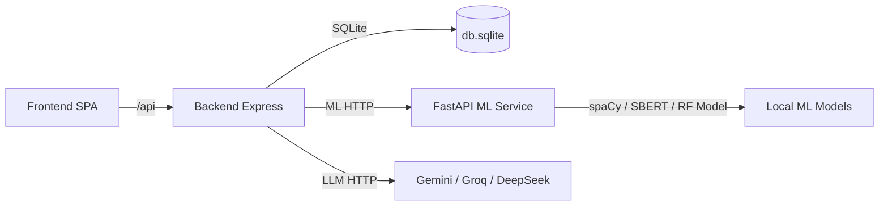

# AI Software Engineer - Detailed Demo Documentation

This document is a presentation-style walkthrough of the project, aligned with the UI flow and the underlying frontend -> backend -> ML pipeline. Each step calls out the database tables used, the API contracts, the backend processing, and how the response is rendered in the frontend.

## 1) System Overview (Architecture + Stack)

### 1.1 Runtime services
- Frontend: React + Vite (SPA). Router-based flow across phases.
- Backend: Node.js + Express. Session-based auth, SQLite persistence, LLM orchestration, document parsing.
- ML service: FastAPI (Python). Local NLP/ML (spaCy, SBERT), defect prediction, traceability, conflict detection, RAG retrieval.

### 1.2 API topology
- Frontend calls backend at `/api` (configurable via `VITE_API_BASE`).
- Backend proxies ML workloads to the ML service at `ML_SERVICE_URL` (defaults to `http://127.0.0.1:8000`).
- LLM calls are direct from backend to provider APIs (Gemini, Groq, DeepSeek).

### 1.3 Database
- Engine: SQLite via `better-sqlite3`.
- File: `backend/data/db.sqlite` (or `DB_PATH` if configured).
- Tables:
  - `users`: authentication accounts.
  - `projects`: project workspace root (title, project_text, srs_content).
  - `srs_sections`: per-section SRS content (wizard sections).
  - `srs_versions`: version history for edits.
  - `project_documents`: project sidebar documents (SRS, design, code, uploads).
  - `requirements`: extracted requirement sentences (from SRS/docs).
  - `artifact_counters`: incremental IDs for requirements/design/test artifacts.
  - `traceability_links`: cross-links between requirements and code/design artifacts.
  - `ml_results`: ML outputs stored with type + score.
  - `logs`: LLM prompt/response tracking.

### 1.4 LLM orchestration
The backend uses a multi-provider LLM service with task-based routing:
- `fast`: quick UI assistance (SRS questions, edits, requirement decomposition, adversarial tests)
- `reasoning`: design + schema generation
- `code`: code generation, translation, tests, refactor
- `review`: multi-agent and code reviews
- `creative`: diagram generation

Providers are tried in order with retry and backoff; auth failures temporarily disable a provider.

### 1.5 ML service pipeline
- spaCy (`en_core_web_sm` or fallback blank model) for linguistic analysis.
- SBERT (`all-MiniLM-L6-v2`) for embeddings; fallback hash-based embeddings if model unavailable.
- RandomForest defect model (trained from open datasets, stored in `ml-service/models/defect_rf_v1.joblib`).
- RAG is in-memory per project (not persisted across restarts).

---

## 2) Demo Flow - From Auth to Full SDLC

### Step 0: Auth (Login / Register)
**UI**: Auth page (login or register).

**Frontend behavior**
- On app load, `AuthContext` calls `/api/auth/me` to detect session.
- Login: POST `/api/auth/login` with `user_id` + `password`.
- Register: POST `/api/auth/register` with name, email, user_id, password, optional phone/age.
- On success, React Router navigates to `/` (projects dashboard).

**Backend processing**
- `POST /api/auth/register`
  - Validates required fields.
  - Hashes password using PBKDF2 with salt.
  - Inserts into `users`.
  - Creates session `req.session.userId`.
- `POST /api/auth/login`
  - Verifies user exists and password hash matches.
  - Sets session.
- `GET /api/auth/me`
  - Reads `users` table for the session user.

**DB tables used**
- `users`

**Response rendering**
- AuthContext updates `user` and `isAuthenticated` state.
- `ProtectedRoute` gates all non-auth pages.

---

### Step 1: Projects Dashboard (Create / Open / Delete)
**UI**: Project list, create form, delete modal.

**Frontend behavior**
- On mount, GET `/api/projects` to list user projects.
- Create: POST `/api/project` with `title` and empty `project_text`.
- Delete: DELETE `/api/project/:id`.
- Open: navigate to `/projects/:projectId`.

**Backend processing**
- `GET /api/projects`: returns projects owned by session user.
- `POST /api/project`: inserts a new project with ID `p<timestamp>` and user association.
- `DELETE /api/project/:id`: verifies ownership then deletes project (cascade to child tables).

**DB tables used**
- `projects`
- (cascade deletes) `srs_sections`, `srs_versions`, `project_documents`, `requirements`, `traceability_links`, `ml_results`, `logs`

**Response rendering**
- Dashboard renders cards with project name and created date.
- Delete modal confirms destructive action.

---

### Step 2: Project Workspace Shell
**UI**: Workspace layout with main content + right-side sidebars.

**Frontend behavior**
- `ProjectLayout` fetches project metadata: GET `/api/project/:id`.
- `ProjectContext` loads documents: GET `/api/projects/:projectId/documents`.
- `ProjectContext` fetches health: GET `/api/projects/:projectId/health`.
- If server fails, falls back to localStorage (for docs) and later syncs.

**Backend processing**
- `GET /api/project/:id`: returns project row + version_count.
- `GET /api/projects/:id/documents`: lists `project_documents`.
- `GET /api/projects/:id/health`:
  - requirements count + avg score
  - document count
  - traceability link count
  - latest ML results

**DB tables used**
- `projects`
- `project_documents`
- `requirements`
- `traceability_links`
- `ml_results`

**Response rendering**
- `PhaseSidebar` shows SDLC spine (requirements/design/implementation/quality) and artifact counts.
- `ProjectSidebar` shows documents and actions (preview, download, context toggle, delete).

**Project document lifecycle**
- Add: POST `/api/projects/:id/documents`
- Delete: DELETE `/api/projects/:id/documents/:docId`
- Toggle context: PATCH `/api/projects/:id/documents/:docId` with `useAsContext`
- If doc type includes "SRS", backend parses requirements and updates `requirements` table.

---

### Step 3: Universal Home (Orchestration Page)
**UI**: 4-phase cards + Multi-Agent Review + Project Memory.

**Frontend behavior**
- On load: GET `/api/project/:id` for title.
- Phase buttons navigate to subroutes.
- Multi-Agent Review: POST `/api/ai/reviews/multi-agent` with project_id.
- Project Memory: POST `/api/ai/rag/answer` with project_id + question.

**Backend processing**
- Multi-agent review:
  - Loads prompt templates for architect/security/performance.
  - Builds context from project documents marked `use_as_context`.
  - Calls LLM 3x in parallel.
- RAG question answering:
  - Pulls context docs (text only, no data URIs).
  - Sends docs + question to ML service `/rag/query`.
  - ML service embeds doc chunks, retrieves top matches.
  - Backend uses LLM to craft final answer + sources.

**DB tables used**
- `project_documents` (context)
- `logs` (LLM interactions)

**Response rendering**
- Review cards (Architect/Security/Performance) show summary, risks, actions.
- RAG panel shows answer + sources.

---

## Phase 1 - Requirements & Analysis

### Step 4: Requirements Workspace (Project Analysis Tool)
**UI**: Project inputs + SDLC recommendation + plan + implicit requirements.

**Frontend behavior**
- SDLC: POST `/api/sdlc/recommend` with `project_text` + constraints.
- Plan: POST `/api/plan/generate` with project details + context docs.
- Implicit requirements: same endpoint `/api/plan/generate` (extracts `implicit_requirements`).
- Results can be saved to sidebar as docs with `useAsContext=true`.

**Backend processing**
- `POST /api/sdlc/recommend`
  - LLM prompt (`sdlc_prompt.txt`).
  - Validates against JSON schema.
  - Stores log entry.
- `POST /api/plan/generate`
  - LLM prompt (`plan_prompt.txt`).
  - Validates schema.
  - Stores log entry.

**DB tables used**
- `logs`
- `project_documents` (when saved)
- `requirements` (if a saved doc type includes SRS)

**Response rendering**
- `ResultsPanel` shows SDLC recommendation, milestones, implicit requirements.
- Save/Download actions create files or project docs.

---

### Step 5: SRS Editor (Wizard Flow)
**UI**: Multi-step wizard: description -> Q&A -> progress -> review.

**Frontend behavior**
1) Description
- User writes project description.
- POST `/api/project` (creates "SRS Project" if no projectId in route).
- POST `/api/srs/generate-questions` with description.

2) Q&A
- For each subsection, user answers questions.
- POST `/api/srs/generate-content` with section + subsection + QA pairs.
- Save section: POST `/api/srs/save-section`.

3) Progress / Review
- GET `/api/srs/status/:projectId` for completion stats.
- POST `/api/srs/generate-final/:projectId` for merged document.
- Export to DOCX: POST `/api/project/:id/export`.

4) Quality & Conflict Analysis
- POST `/api/ml/requirements/analyze` with extracted requirement sentences.
- POST `/api/ml/conflict/detect` with requirement sentences.

**Backend processing**
- `generate-questions`: prompt `srs_generate_prompt.txt`.
- `generate-content`: prompt `srs_content_prompt.txt`.
- `save-section`: upserts into `srs_sections`.
- `generate-final`: composes document from saved sections, fills missing with placeholders, writes `projects.srs_content`, syncs requirements.
- `export`: uses `docx-generator` to build DOCX.
- ML analysis: proxies to ML service and enriches with LLM explanations for low scores.

**DB tables used**
- `projects`
- `srs_sections`
- `srs_versions` (for editing/versions if used)
- `requirements` (synced from final SRS)
- `logs`

**Response rendering**
- Q&A view shows generated subsection content and allows accept/regenerate.
- Progress view shows completion stats and live SRS preview.
- Review view shows final SRS and analysis tabs (quality + conflicts).
- Conflict view renders a graph with `react-force-graph-2d`.

---

## Phase 2 - System Design

### Step 6: Design Studio (Landing)
**UI**: Entry hub for design tools.

**Frontend behavior**
- Links to:
  - System Design & Tech Stack Wizard
  - Database Schema Generator
  - Diagram Generator

**Backend usage**
- None directly (navigation only).

**DB tables used**
- None directly.

---

### Step 7: System Design & Tech Stack Wizard
**UI**: Form for environment constraints + generated design tabs.

**Frontend behavior**
- Gathers context docs marked "Use in context".
- Extracts text for PDFs/DOCX by calling:
  - POST `/api/documents/extract-text`.
- Sends combined text + context:
  - POST `/api/design/system` with `srs_text` and `context`.
- Allows download + save to sidebar.

**Backend processing**
- `POST /api/design/system`:
  - Validates input is text (not base64).
  - Prompt `system_design_prompt.txt`.
  - LLM returns structured JSON or raw fallback.
  - Logs the call.

**DB tables used**
- `project_documents` (context docs)
- `logs`

**Response rendering**
- Tabs: High-level design, Tech stack, Implementation architecture, Assumptions, Next steps, plus diagram context presets.
- Save to sidebar stores a `Design` doc and marks as context.

---

### Step 8: Database Schema Generator
**UI**: Text input for entities/stories + output panels.

**Frontend behavior**
- Optional context docs extracted via `/api/documents/extract-text`.
- POST `/api/design/schema` with requirements_text + output_format + context_text.
- Save to sidebar and copy actions.

**Backend processing**
- LLM prompt `database_schema_prompt.txt`.
- JSON parse with fallback to raw text.
- Logs prompt and output.

**DB tables used**
- `project_documents` (context)
- `logs`

**Response rendering**
- Entities/fields, relationships, NoSQL collections, sample queries.

---

### Step 9: Diagram Generator
**UI**: Diagram type selection + Mermaid renderer.

**Frontend behavior**
- Optional context documents extracted via `/api/documents/extract-text`.
- POST `/api/design/diagram` with diagram_type + project_info + context_text.
- Renders Mermaid via CDN (client-side), allows copy/save/download.

**Backend processing**
- LLM prompt `diagram_generation_prompt.txt`.
- Normalizes Mermaid output (edge labels, ER types, and graph edges).
- Logs the request.

**DB tables used**
- `project_documents` (context)
- `logs`

**Response rendering**
- Mermaid graph rendered to SVG, downloadable as PNG/SVG.
- Saved diagrams appear in project sidebar.

---

## Phase 3 - Coding & Implementation

### Step 10: Implementation Lab
**UI**: Tabs for Generate, Translate, Review.

**Frontend behavior**
- Build `context` from sidebar docs marked `useAsContext`.
- Generate: POST `/api/code/generate`.
- Translate: POST `/api/code/translate`.
- Review: POST `/api/code/review`.
- Save output to sidebar as docs.
- Send to tests -> navigates to Quality Center with code payload.

**Backend processing**
- Prompts: `code_generate_prompt.txt`, `code_translate_prompt.txt`, `code_review_prompt.txt`.
- Parses JSON, validates code presence, logs request.

**DB tables used**
- `project_documents` (context + saved outputs)
- `logs`

**Response rendering**
- Code blocks + summary and actions (copy, download, save, review, test).

---

## Phase 4 - Testing & Quality

### Step 11: Quality Center (Tests & Quality)
**UI**: Code input + comprehensive test report.

**Frontend behavior**
- POST `/api/code/test` with `language`, `code`, `instructions`, `want_fix`, `context`.
- Save report to sidebar as `Quality Report`.

**Backend processing**
- LLM prompt `code_test_prompt.txt`.
- Produces test cases, metrics, verdicts, optional improved code.
- Logs request.

**DB tables used**
- `project_documents` (context + saved reports)
- `logs`

**Response rendering**
- Summary + per-test results + metrics cards.

---

### Step 12: Intelligence (Code Intelligence Panel)
**UI**: Defect risk + traceability + refactor loop.

**Frontend behavior**
- Extracts requirements from context docs (sentences with shall/must/should/etc).
- Extracts function names from code (simple regex + Python `def` parsing).
- POST `/api/ml/defect/predict`.
- POST `/api/ml/traceability/analyze`.
- Closed-loop refactor: POST `/api/ml/defect/refactor`.

**Backend processing**
- `/ml/defect/predict` -> ML service `code/defect/predict`.
- `/ml/traceability/analyze` -> ML service `code/traceability/analyze`.
- `/ml/defect/refactor`:
  - Runs defect prediction first.
  - Builds LLM prompt (`refactor_loop_prompt.txt`) using risk signals.
  - Calls ML service again to compare before/after.

**ML service behavior**
- Defect predictor:
  - Extracts functions (Python or JS), computes CC, Halstead, LOC.
  - Uses RandomForest if available, otherwise heuristic risk scoring.
  - SHAP explanations when possible.
- Traceability:
  - SBERT embeddings for requirements and function signatures.
  - Cosine similarity -> strong/weak links.

**DB tables used**
- `project_documents` (requirements context)
- `ml_results` (not written by this endpoint currently, but health summary reads it)

**Response rendering**
- Defect risk per function with metrics.
- Traceability coverage summary (links, orphaned requirements, orphaned code).
- Refactor panel shows before/after risk and refactored code.

---

## 3) Support Features and Internal Flows

### 3.1 Document extraction service
**Endpoint**: `POST /api/documents/extract-text`
- Supports PDF (pdf-parse), DOCX (mammoth), text data URIs.
- Returns extracted text + metadata.
- Used by System Design Wizard, Schema Generator, Diagram Generator.

### 3.2 Project health + traceability
**Endpoints**:
- `GET /api/projects/:id/health` (used by PhaseSidebar)
- `GET /api/projects/:id/traceability` (available for future dashboards)
- `POST /api/projects/:id/requirements/sync` (manual sync if needed)

**Data sources**:
- `requirements` (quality scores)
- `traceability_links` (coverage links)
- `project_documents` (document count)
- `ml_results` (recent ML output history)

### 3.3 SRS versioning
**Endpoints**:
- `POST /api/srs/edit` (LLM edit suggestion for selected text)
- `POST /api/srs/apply` (apply suggestion, creates new version)
- `GET /api/project/:id/versions`
- `GET /api/project/:id/version/:version`

**DB tables**:
- `srs_versions`

### 3.4 LLM logging
All major LLM routes store prompts and responses in `logs` for debugging and evaluation.

---

## 4) End-to-End Data Flow (High Level)

---

## 5) Typical Demo Script (Presentation-Style)

1) Authenticate
- Register or login. Session cookie is established in the backend and all `/api/*` routes are now accessible.

2) Create a project
- Create a project named "Payments Modernization". The backend inserts into `projects` and returns the new workspace ID.

3) Enter the universal workspace
- Open the project. The layout loads metadata, documents, and health metrics.
- The SDLC Spine on the right updates as requirements and quality scores appear.

4) Requirements & Analysis
- Provide project description and constraints.
- Generate SDLC recommendation and project plan. Save both to sidebar.
- Run requirement decomposer and adversarial tester for initial risk discovery.

5) SRS Wizard
- Generate SRS questions, answer them, and create sections.
- Generate the final SRS document and export to DOCX.
- Run Quality Analysis and Conflict Detection; review scores and conflict graph.

6) Design Studio
- Use the System Design Wizard with your SRS as context.
- Generate a tech stack and architecture breakdown; save it.
- Generate a database schema and a diagram (ER / sequence / data flow).

7) Implementation Lab
- Generate code scaffolding (e.g., service skeleton + API layer).
- Translate between languages if needed.
- Run a code review to surface issues before testing.

8) Quality Center
- Paste code and generate exhaustive tests + metrics.
- Save the quality report to the project.
- Switch to Intelligence to run defect prediction and traceability.

9) Project Memory + Multi-Agent Review
- From Universal Home, ask the project memory a question.
- Run multi-agent reviews for architectural, security, and performance risks.

---

## 6) Ports and Services
- Frontend: http://localhost:5173
- Backend: http://localhost:4000
- ML service: http://127.0.0.1:8000

---

## 7) What Makes This Project Distinct
- Full SDLC flow with a single persistent workspace.
- Context-aware AI that feeds on saved project documents.
- Hybrid architecture: LLM reasoning + local ML services.
- Traceability and quality checks tie requirements to code continuously.
- Extensible prompts-based engine for new SDLC tools.
